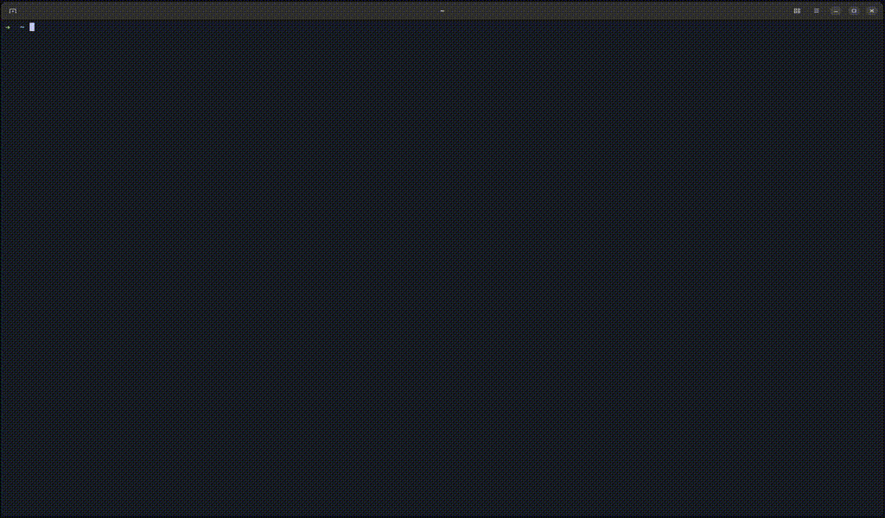

# rtfm

`rtfm` makes it easy to find and browse source code on your system. It scans everything, including
virtual environments, `node_modules`, Maven repositories, and more, so you can quickly look up code
while you work.



## Features

`rtfm` builds an index of third party dependencies that already exist on your system, across all of
your projects, then lets you navigate them using `fzf`, and view them with syntax highlighting.

Supported languages:

- JavaScript / TypeScript
- Python
- Java
- Go

## Installation

Install `fzf`

```bash
sudo apt install fzf
```

Build and install

```bash
make install
```

Make sure that the `rtfm` binary is in your `PATH`. You can do this by adding the following line to
your `~/.bashrc` or `~/.zshrc` file:

```bash
export PATH="$PATH:$(go env GOPATH)/bin"
```

## Usage

Index code and documentation

```bash
rtfm index 
```

Search everything

```bash
rtfm search <query>
```

Search for a specific language

```bash
rtfm search <query> --lang <language>
```

Search for an exact match

```bash
rtfm search <query> --exact
```

## License

This project is licensed under the [Apache License 2.0](LICENSE). You are free to use, modify, and
distribute this software under the terms of the license.
